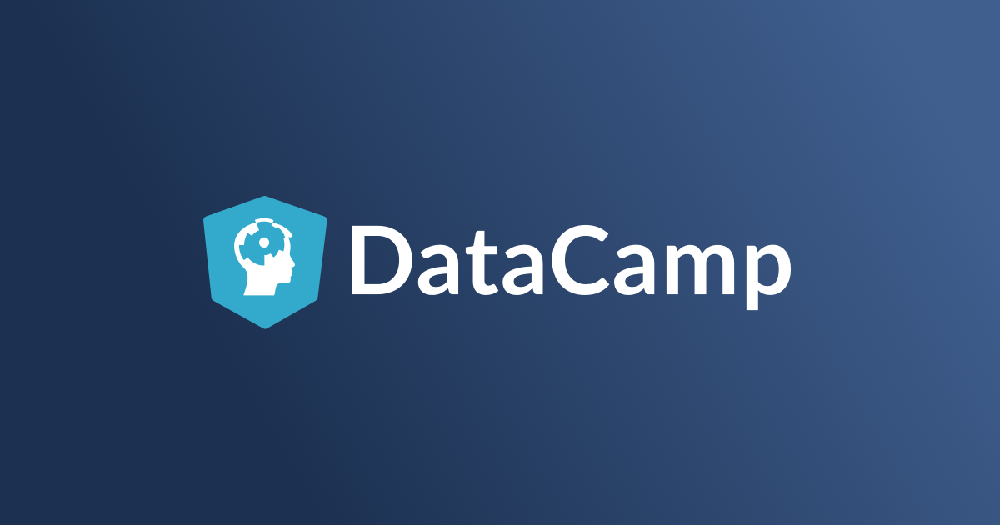

# DataCamp 

[**DataCamp**](https://www.datacamp.com) is an online learning platfrom with interactive courses, practices, and projects. Not only R but Python is appied in different projects, and those mini-projects could help you hone your coding skill and the machine learning knowledge! You can also find some useful cheatsheet [here](https://github.com/jusliu9547/DataCamp/tree/master/Cheatsheet) in case of forgetting some functions or arguments.

Leave a :star: if helpful! :wink:

## R project 
|Project Name|Description |Note
|:------|:-----|:---------|
|`A Text Analysis of Trump's Tweets`|Apply text mining to Donald Trump's tweets to confirm if he writes the (angrier) Android half|
|`A Visual History of Nobel Prize Winners`|Explore a dataset from Kaggle containing a century's worth of Nobel Laureates. Who won? Who got snubbed?|
|`Are You Ready for the Zombie Apocalypse?`| Use your logistic regression skills to protect people from becoming zombies!|
|`Bad passwords and the NIST guidelines`|Check what passwords fail to conform to the National Institute of Standards and Technology password guidelines.|
|`Clustering Bustabit Gambling Behavior`|Use cluster analysis to glean insights into cryptocurrency gambling behavior.|
|`Clustering Heart Disease Patient Data`|Experiment with clustering algorithms to help doctors inform treatment for heart disease patients.|
|`Data Science for Social Good/ Crime Study`|Use data science to catch criminals, plus find new ways to volunteer personal time for social good.| `ggmap`|
|`Degrees That Pay You Back`|Explore the salary potential of college majors with a k-means cluster analysis.|`KMeans`|
|`Dr. Semmelweis and the Discovery of Handwashing`|Reanalyse the data behind one of the most important discoveries of modern medicine: handwashing.|
|`Draw flowers using mathematics`|Use R to make art and create imaginary flowers inspired by nature.|
|`Drunken Datetimes in Ames, Iowa`|Apply your skills from "Working with Dates and Times in R" to breathalyzer data from Ames, Iowa.|
|`Explore 538's Halloween Candy Rankings`|Get ready for Halloween by digging into a FiveThirtyEight dataset with all your favorite candy!|
|`Exploring the Kaggle Data Science Survey`|Discover the top tools Kaggle participants use for data science and machine learning.|
|`Functions for Food Price Forecasts`|Write functions to forecast time series of food prices in Rwanda.|
|`Gender Bias in Graduate Admissions`|Analyze admissions data from UC Berkeley and find out if the university was biased against women.|Simpson's paradox|
|`Going Down to South Park: A Text Analysis`|Analyze the dialog and IMDB ratings of 287 South Park episodes. Warning: contains explicit language.|
|`Importing and Cleaning Data`|Apply your importing and data cleaning skills to real-world soccer data.|
|`Health Survey Data Analysis of BMI`|Analyze health survey data to determine how BMI is associated with physical activity and smoking.|
|`Kidney Stones and Simpson's Paradox`|Use logistic regression to determine which treatment procedure is more effective for kidney stone removal.|
|`Level Difficulty in Candy Crush Saga`|Analyze data from the hit mobile game, Candy Crush Saga.|
|`Modeling the Volatility of US Bond Yields`|Discover how the US bond yields behave using descriptive statistics and advanced modeling.|
|`Partnering to Protect You from Peril`|Examine the network of connections among local health departments in the United States.|Network analysis|
|`Planning Public Policy in Argentina`|Apply unsupervised learning techniques to help plan an education program in Argentina.|
|`Predict Taxi Fares with Random Forests`|Use regression trees and random forests to find places where New York taxi drivers earn the most.|
|`Reducing Traffic Mortality in the USA`|How can we find a good strategy for reducing traffic-related deaths?|
|`Rise and Fall of Programming Languages`|Analyze the relative popularity of programming languages over time based on Stack Overflow data.|
|`Scout Your Athletics Fantasy Team`|Analyze athletics data to find new ways to scout and assess jumpers and throwers.|
|`Text Mining America's Toughest Game Show`|Use text mining to analyze Jeopardy! data.|
|`The Impact of Climate Change on Birds`|Predict the impact of climate change on bird distributions using spatial data and machine learning.|
|`Trends in Maryland Crime Rates`|Apply hierarchical and mixed-effect models to analyze Maryland crime rates.|GLMM|
|`TV, Halftime Shows, and the Big Game`|Load, clean, and explore Super Bowl data in the age of soaring ad costs and flashy halftime shows.|
|`Visualizing Inequalities in Life Expectancy`|Compare life expectancy across countries and genders with ggplot2.|
|`What Makes a Pokémon Legendary?`|Use tree-based machine learning methods to identify the characteristics of legendary Pokémon.|
|`What Your Heart Rate Is Telling You`|Examine the relationship between heart rate and heart disease using multiple logistic regression.|
|`Where Are the Fishes?`|
|`Where Would You Open a Chipotle?`|Create and explore interactive maps using Leaflet to determine where to open the next Chipotle.|
|`Who Is Drunk and When in Ames, Iowa?`|Flex your tidyverse muscles on breath alcohol test data from Ames, Iowa, USA.|
|`Wrangling and Visualizing Musical Data`|Wrangle and visualize musical data to find common chords and compare the styles of different artists.|

## Python project ##

|Project Name|Description |Note
|:------|:-----|:---------|
|`A Network Analysis of Game of Thrones`|Analyze the network of characters in Game of Thrones and how it changes over the course of the books.|
|`A New Era of Data Analysis in Baseball`|Use MLB's Statcast data to compare New York Yankees sluggers Aaron Judge and Giancarlo Stanton.|
|`A Visual History of Nobel Prize Winners`|Explore a dataset from Kaggle containing a century's worth of Nobel Laureates. Who won? Who got snubbed?|
|`Analyze Your Runkeeper Fitness Data`|Import, clean, and analyze seven years worth of training data tracked on the Runkeeper app.|
|`ASL Recognition with Deep Learning`|Build a convolutional neural network to classify images of letters from American Sign Language.|`Keras`|
|`Bad passwords and the NIST guidelines`|Check what passwords fail to conform to the National Institute of Standards and Technology password guidelines.|
|`Book Recommendations from Charles Darwin`|Build a book recommendation system using NLP and the text of books like "On the Origin of Species."|
|`Classify Song Genres from Audio Data`|Rock or rap? Apply machine learning methods in Python to classify songs into genres.|
|`Comparing Cosmetics by Ingredients`|Process ingredient lists for cosmetics on Sephora then visualize similarity using t-SNE and Bokeh.|t-SNE, `Boken`|
|`Disney Movies and Box Office Success`|Explore Disney movie data, then build a linear regression model to predict box office success.|
|`Do Left-handed People Really Die Young?`|Use pandas and Bayesian statistics to see if left-handed people actually die earlier than righties.|
|`Dr. Semmelweis and the Discovery of Handwashing`|Reanalyse the data behind one of the most important discoveries of modern medicine: handwashing.|
|`Exploring 67 years of LEGO`|In this project we will explore a database of every LEGO set ever built.|
|`Exploring the Bitcoin Cryptocurrency Market`|You will explore the market capitalization of Bitcoin and other cryptocurrencies.|
|`Exploring the Evolution of Linux`|Find out about the evolution of the Linux operating system by exploring its version control system.|
|`Find Movie Similarity from Plot Summaries`|Use NLP and clustering on movie plot summaries from IMDb and Wikipedia to quantify movie similarity.|
|`Generating Keywords for Google Ads`|Automatically generate keywords for a search engine marketing campaign using Python.|
|`Give Life: Predict Blood Donations`|Build a binary classifier to predict if a blood donor is likely to donate again.|
|`Mobile Games A/B Testing with Cookie Cats`|Analyze an A/B test from the popular mobile puzzle game, Cookie Cats.|
|`Naïve Bees: Deep Learning with Images`|Build a deep learning model that can automatically detect honey bees and bumble bees in images.|`Keras`|
|`Naïve Bees: Image Loading and Processing`|Load, transform, and understand images of honey bees and bumble bees in Python.|
|`Naïve Bees: Predict Species from Images`|Build a model that can automatically detect honey bees and bumble bees in images.|
|`Name Game: Gender Prediction using Sound`|Analyze the gender distribution of children's book writers and use sound to match names to gender.|
|`Predict Stock Trends from News Headlines`|Scrape news headlines for FB and TSLA then apply sentiment analysis to generate investment insight.|`BeautifulSoup`|
|`Predicting Credit Card Approvals`|Build a machine learning model to predict if a credit card application will get approved.|
|`Recreating John Snow's Ghost Map`|Recreate John Snow's famous map of the 1854 cholera outbreak in London.|
|`Reducing Traffic Mortality in the USA`|How can we find a good strategy for reducing traffic-related deaths?|`Seaborn`|
|`Risk and Returns: The Sharpe Ratio`|Use pandas to calculate and compare profitability and risk of different investments using the Sharpe Ratio.|
|`The Android App Market on Google Play`|Load, clean, and visualize scraped Google Play Store data to understand the Android app market.|
|`The GitHub History of the Scala Language`|Find the true Scala experts by exploring its development history in Git and GitHub.|
|`The Hottest Topics in Machine Learning`|Use Natural Language Processing on NIPS papers to uncover the trendiest topics in machine learning research.|LDA|
|`TV, Halftime Shows, and the Big Game`|Load, clean, and explore Super Bowl data in the age of soaring ad costs and flashy halftime shows.|
|`Up and Down With the Kardashians`|Plot Google Trends data to find the most famous Kardashian/Jenner sister. Is it Kim? Kendall? Kylie?|
|`Which Debts Are Worth the Bank's Effort?`|Play bank data scientist and use regression discontinuity to see which debts are worth collecting.|
|`Who Is Drunk and When in Ames, Iowa?`|Flex your pandas muscles on breath alcohol test data from Ames, Iowa, USA.|
|`Who's Tweeting? Trump or Trudeau?`|Build a machine learning classifier that knows whether President Trump or Prime Minister Trudeau is tweeting!|
|`Word Frequency in Moby Dick`|Use web scraping and NLP to find the most frequent words in Herman Melville's novel, Moby Dick.|

## SQL project ##

|Project Name|Description |Note
|:------|:-----|:---------|
|`Analyze International Debt Statistics`|Write SQL queries to answer interesting questions about international debt using data from The World Bank.|
|`Introduction to DataCamp Projects`|If you've never done a DataCamp project, this is the place to start!|
|`TV, Halftime Shows, and the Big Game`|Load, clean, and explore Super Bowl data in the age of soaring ad costs and flashy halftime shows.|

## Cheatsheet ##

* Data Transformation with dplyr
* Data Visualization with ggplot2
* LATEX math notation
* Date and Time with lubridate
* Data Wrangling with pandas
* R Markdown
* Shiny
* String Manipulation with stringr

